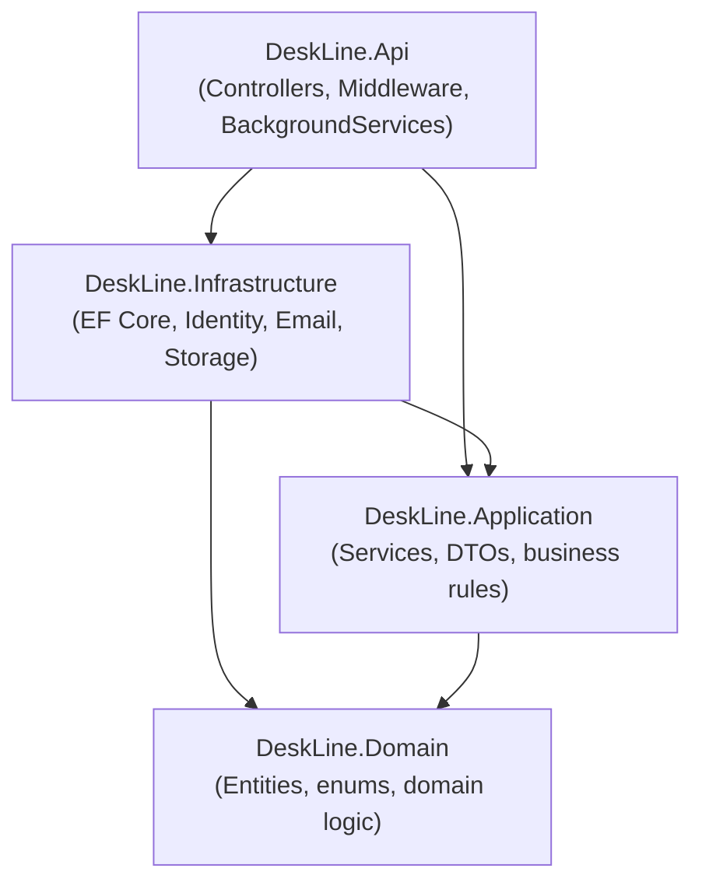

# DeskLine — Architecture

**Status:** Draft v1 — Week 1 design artifact (Step 2.4, Architecture Design)
**Owner:** Omar
**Depends on:** `requirements.md`, `database-design.md`, `api-contract.md`, `decisions.md` (D1–D19)

---

## 0. How this doc is organized

This doc deliberately doesn't repeat what's already written elsewhere — it links out instead. Its job is narrower than "explain the whole system": it covers the two things no other doc owns — how the folders map to the layers, and how one request actually travels through them.

- **System Overview** — the shape, in a few sentences
- **Layer Diagram** — the dependency direction, visually
- **Directory & Module Mapping** — which folder is which layer, and what belongs in it
- **Data Flow** — one real request, traced end-to-end
- **Design Boundaries & Rules** — what each layer is and isn't allowed to do
- **Permission Matrix** — role × action, derived from `api-contract.md`
- **Key Decisions & Why** — pointers into `decisions.md`, not a re-explanation

---

## 1. System Overview

DeskLine is a single ASP.NET Core (C#) Web API backing a React (TypeScript) frontend, backed by a single PostgreSQL instance (NFR-15). Full tech stack: see `README.md`. The system is built as four internal layers (Clean/Layered Architecture, D2) rather than one flat project, specifically so business rules — SLA logic, authorization, audit logging — are unit-testable without spinning up HTTP or a database.

No external services are load-bearing in v1: email notifications (FR-6) go through an abstracted `IEmailSender`, and file attachments (FR-22) are stored on local disk behind an abstracted `IFileStorage` — both swappable later without touching business logic.

---

## 2. Layer Diagram



Arrows point **from** the dependent project **to** the project it references — so this reads as "Api depends on Infrastructure and Application," "Infrastructure depends on Application and Domain," and so on. Domain has no outgoing arrow: it depends on nothing else in the solution (D2, D18). This isn't just a convention — it's enforced by the actual `.csproj` project references, so a violation fails to compile rather than relying on someone noticing in review.

---

## 3. Directory & Module Mapping

```
DeskLine.sln
DeskLine.Domain/
├── Entities/            Ticket, TicketComment, Attachment, Category, AuditLogEntry
├── Enums/                TicketStatus, TicketPriority, UserRole, AuditAction
├── Exceptions/           DomainException, InvalidStatusTransitionException
└── Common/               ISlaPolicyProvider (D11)

DeskLine.Application/
├── Tickets/              ITicketService + impl, Dtos/
├── Auth/                 IAuthService + impl, Dtos/
├── Categories/           ICategoryService + impl, Dtos/
├── Users/                IUserService + impl, Dtos/ (incl. AgentOptionDto)
├── AuditLog/             IAuditLogService + impl, Dtos/
├── Analytics/             IAnalyticsService, Dtos/
├── Sla/                  ISlaSweepService
├── Common/               ICurrentUserContext, IDateTime/TimeProvider wrapper
└── DependencyInjection.cs

DeskLine.Infrastructure/
├── Identity/             ApplicationUser (D13)
├── Persistence/          DeskLineDbContext, EF Configurations/, Migrations/
├── Sla/                  HardcodedSlaPolicyProvider (D11), SlaSweepService
├── Email/                IEmailSender, SmtpEmailSender
├── Storage/               IFileStorage, LocalFileStorage
└── DependencyInjection.cs

DeskLine.Api/
├── Controllers/          Auth, Tickets, Categories, Users, Agents, AuditLog, Analytics
├── BackgroundServices/   SlaSweepBackgroundService (thin loop over Application's ISlaSweepService)
├── Middleware/           ExceptionHandlingMiddleware
└── Program.cs

DeskLine.UnitTests/        references Application + Domain only — no Infrastructure
DeskLine.IntegrationTests/ references everything — WebApplicationFactory + Testcontainers
```

**Layer-to-project, in one line each:**
- **Domain** — what the business *is*: entities, enums, invariants. No framework dependency, no NuGet packages beyond the BCL.
- **Application** — what the business *does*: use-case services, DTOs, orchestration. Depends only on Domain — this is what makes services unit-testable in isolation.
- **Infrastructure** — how it's actually persisted/sent/stored: EF Core, Identity, email, file storage. The only layer allowed to know about a database or the filesystem.
- **Api** — HTTP in, HTTP out. Controllers translate requests to Application calls and Application results back to HTTP responses — no business rules live here (D2).

---

## 4. Data Flow — `POST /api/v1/tickets` end-to-end

Chosen because it's the single request that touches the most of the system: authentication, DTO validation, a domain invariant (FR-20a), the round-robin assignment algorithm (D5), SLA deadline computation (D11), and the audit log (D3) — all in one call.

```
1. Browser → TicketsController.Create(CreateTicketRequest)
   - [Api layer] JWT validated by ASP.NET Core auth middleware before the
     action even runs. Role checked: Customer only.

2. Controller → ITicketService.CreateAsync(request, currentUserId)
   - [Api → Application] Controller does no business logic — it maps the
     multipart request into the DTO and calls the service. That's it.

3. TicketService (Application layer):
   a. Validates the DTO (FluentValidation) — subject/description length,
      categoryId exists and is active.
   b. Round-robin: queries active Agents with fewest open tickets,
      ties broken by lowest Id (FR-20a, D5). If no active Agent exists,
      throws a domain error — ticket creation fails outright.
   c. Computes FirstResponseDeadline and ResolutionDeadline via
      ISlaPolicyProvider (an interface — Application doesn't know or care
      that the real implementation is hardcoded, D11).
   d. Constructs the Ticket entity (Domain layer — pure object construction,
      no I/O yet).
   e. Calls IUnitOfWork/DbContext to save the Ticket AND write the
      AuditLog "Created" entry in the same transaction (D3, D12) — one
      commits, or neither does.

4. TicketService → Infrastructure (EF Core)
   - [Application → Infrastructure, via DI-injected interfaces] The actual
     INSERT statements happen here. Application never references EF Core
     directly — it depends on repository/DbContext abstractions.

5. Response: TicketService returns a Domain Ticket → Controller maps it to
   TicketDetailDto → serialized as the 201 Created response body
   (api-contract.md §3.1).
```

The point this diagram is making concrete: at no point does the Api layer touch the database directly, and at no point does Application know it's talking to Postgres specifically — both could be swapped without the other layer changing. That's the practical payoff of D2, not just a theoretical one.

---

## 5. Design Boundaries & Rules

Stated explicitly, not left implicit:

- **Domain has zero outward dependencies.** No reference to Application, Infrastructure, or any NuGet package beyond the base class library (D2). No navigation properties to `ApplicationUser` (D18).
- **Controllers contain no business logic.** HTTP in/out only — validation of the *shape* of a request can live in the DTO/FluentValidation, but any rule about *what's allowed* (role checks beyond `[Authorize]`, status transitions, ownership) lives in Application.
- **Only Infrastructure may reference EF Core, ASP.NET Core Identity, or any I/O library** (email, file storage). If a `using Microsoft.EntityFrameworkCore` ever appears in `Application/` or `Domain/`, that's a boundary violation.
- **DTOs cross the Api ↔ Application boundary — entities never do** (NFR-14). A controller action never returns a `Ticket`; it returns a `TicketDetailDto`.
- **Application depends on Domain only, never on Infrastructure.** Services receive their dependencies (DbContext, email sender, etc.) as interfaces via constructor injection, implemented in Infrastructure and wired up at startup (`Program.cs`).
- **Cross-cutting rules keep living in `database-design.md` §1 and `decisions.md`** — this doc doesn't restate them (e.g. `TimeProvider` over `DateTime.UtcNow`, string-backed enums).

---

## 6. Permission Matrix

Derived directly from `api-contract.md`'s endpoint table — reshaped here as role × capability, since that's the more useful view for reasoning about authorization bugs.

| Capability | Customer | Agent | Admin |
|---|---|---|---|
| Register / log in / log out | ✅ (own account) | ✅ | ✅ |
| Reset own password | ✅ | ✅ | ✅ |
| Create a ticket | ✅ | ❌ | ❌ |
| View own tickets | ✅ | — | — |
| View assigned tickets | — | ✅ | ✅ (any agent's, via "view all tickets") |
| View all tickets | ❌ | ❌ | ✅ |
| Comment on a ticket (customer-visible) | ✅ (own, Open/InProgress only) | ✅ | ✅ |
| Add an internal note | ❌ | ✅ | ✅ |
| Change ticket status | ❌ | ✅ | ✅ |
| Close own ticket | ✅ (the one transition) | — | — |
| Set/change priority | ❌ | ✅ | ✅ |
| Reassign a ticket | ❌ | ✅ (to an active Agent) | ✅ |
| View active-Agent list | ❌ | ✅ | ✅ |
| Manage categories | ❌ | ❌ | ✅ |
| Manage user accounts | ❌ | ❌ | ✅ |
| View audit log | ❌ | ❌ | ✅ |
| View analytics | ❌ | ❌ | ✅ |

`—` marks "not applicable to this role's scope" rather than "forbidden" (e.g. a Customer viewing "own tickets" isn't a restricted version of "view all tickets," it's a different query entirely, scoped server-side per NFR-3/D15).

---

## 7. Key Decisions & Why

The reasoning behind every non-obvious choice reflected in the diagrams above already lives in `decisions.md` — this section only points to it, rather than duplicating it and risking drift:

- **D2** — why Clean/Layered Architecture over fat controllers
- **D5** — why round-robin auto-assignment, and why self-claim was rejected (concurrency)
- **D11** — why `ISlaPolicyProvider` sits behind an interface rather than being called directly
- **D13** — why Identity lives in Infrastructure with `Role` as an enum
- **D18** — why Domain never holds a navigation property to `ApplicationUser`

---

## 8. Traceability note

Every folder above maps to a named layer in §2, and every layer maps to a rule in §5. If a future file doesn't obviously belong in one of the folders listed in §3, that's a signal to check §5 before creating it, not a reason to force it into the nearest-looking folder.
