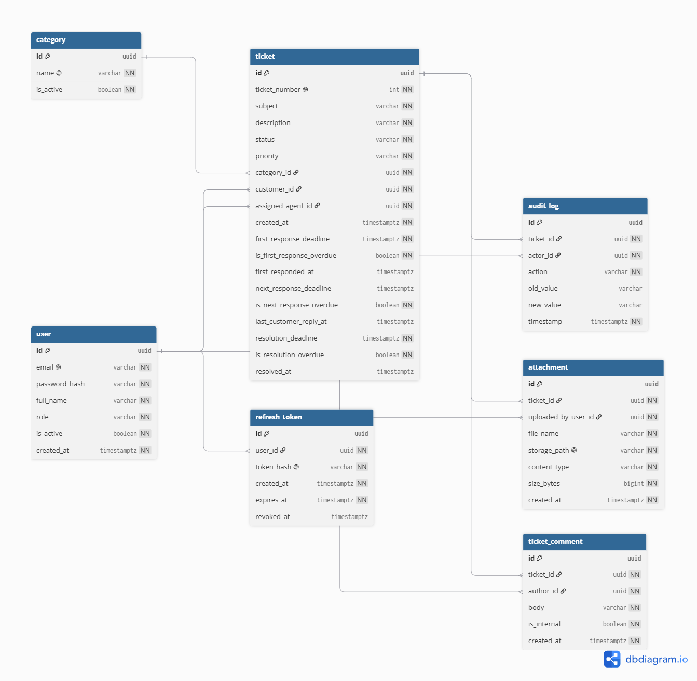

# DeskLine — Database Design

**Status:** Draft v1 — Week 1 design artifact (Step 2.2, Domain Modeling)
**Owner:** Omar
**Depends on:** `requirements.md`, `decisions.md` (D1–D19)

---

## 0. How this doc is organized

- **Conventions** — rules that apply across every entity, stated once here instead of repeated per table
- **One section per entity** — a short role description, a field table, a relationships list, and on-delete behavior
- **ERD** — an embedded PNG (`docs/diagrams/erd.png`), a live dbdiagram.io link, and the DBML source (collapsed) for anyone who wants to edit it

Entity order follows dependency order: entities with no foreign keys first, so every FK a later table references has already been defined by the time you reach it.

---

## 1. Conventions

- **Primary keys:** `Guid` (Postgres `uuid`), generated client-side (`Guid.NewGuid()`), unless noted otherwise.
- **Timestamps:** `timestamptz`, stored in UTC. Application code reads the clock through an injected `TimeProvider`, never `DateTime.UtcNow` directly — this is what makes SLA logic testable with `FakeTimeProvider` (D11, D16).
- **Enums:** stored as strings via EF Core value conversion (`HasConversion<string>()`), not as integers, so a row is readable directly in the database without a lookup table.
- **No soft-delete** anywhere in v1, except the two explicit `IsActive` flags below (`User`, `Category`) — each a deliberate, narrow decision, not a generic pattern applied everywhere.
- **String lengths:** every `string` column has an explicit max length, enforced both by a FluentValidation rule on the DTO (friendly 400) and a Postgres column constraint (the safety net).
- **No navigation properties from Domain entities to `ApplicationUser`** — `Ticket`, `TicketComment`, `Attachment`, and `AuditLog` reference users via bare `Guid` foreign keys only (D18). User-detail lookups for display are done via explicit joins/projections in the Application layer, not `.Include()`.

---

## 2. `User`

`ApplicationUser : IdentityUser<Guid>` in the Infrastructure layer (D13). Identity supplies `Id`, `Email`, `NormalizedEmail`, `PasswordHash`, and the lockout fields (`AccessFailedCount`, `LockoutEnd`) — these aren't re-listed below since they're inherited, not hand-rolled.

| Field | Type | Nullable | Constraints | Notes |
|---|---|---|---|---|
| `Id` | `Guid` | No | PK | Inherited from `IdentityUser<Guid>` |
| `Email` | `string` | No | Unique (Identity's `NormalizedEmail` index) | |
| `PasswordHash` | `string` | No | | Inherited; never logged (NFR-1) |
| `FullName` | `string` | No | Max 100 | Display name for ticket threads, agent queue, audit log actor names |
| `Role` | `enum` (`Customer`/`Agent`/`Admin`) | No | | D6 |
| `IsActive` | `bool` | No | Default `true` | Deactivation flag (FR-14); blocks login and revokes refresh tokens when set `false` |
| `CreatedAt` | `timestamptz` | No | | |

**Relationships:** Referenced by `RefreshToken`, `Ticket` (as Customer and as Agent), `TicketComment`, `Attachment`, and `AuditLog`. Has no outgoing FK itself.

**On delete:** Users are never hard-deleted in v1 — `IsActive = false` is the only removal path. On-delete behavior only matters for the tables that reference `User` (see each below).

---

## 3. `RefreshToken`

Separate table per D7, supporting multi-session logout (FR-1a/FR-1b).

| Field | Type | Nullable | Constraints | Notes |
|---|---|---|---|---|
| `Id` | `Guid` | No | PK | |
| `UserId` | `Guid` | No | FK → `User.Id` | |
| `TokenHash` | `string` | No | Unique | The raw token is never stored — only its hash (D1) |
| `CreatedAt` | `timestamptz` | No | | |
| `ExpiresAt` | `timestamptz` | No | CHECK `ExpiresAt > CreatedAt` | 7-day lifetime (NFR-2) |
| `RevokedAt` | `timestamptz` | Yes | | Null = still valid. Set on logout, logout-all, rotation, or deactivation |

**Relationships:** Belongs to one `User`.

**On delete:** `UserId` → `ON DELETE CASCADE`. Safe specifically because `User` rows are never actually deleted in v1 — this only matters in the hypothetical of a manual DB cleanup, not in normal operation.

---

## 4. `Category`

| Field | Type | Nullable | Constraints | Notes |
|---|---|---|---|---|
| `Id` | `Guid` | No | PK | |
| `Name` | `string` | No | Unique, max 100 | FR-17 |
| `IsActive` | `bool` | No | Default `true` | Retired categories stay referenced by historical tickets but drop out of the create-ticket picker |

**Relationships:** Referenced by `Ticket.CategoryId`.

**On delete:** No hard delete in v1 — same pattern as `User`. `Ticket.CategoryId` → `ON DELETE RESTRICT` as a safety net regardless, since the app itself never offers a hard-delete action.

---

## 5. `Ticket`

The central aggregate — almost every other entity either belongs to a `Ticket` or references it.

| Field | Type | Nullable | Constraints | Notes |
|---|---|---|---|---|
| `Id` | `Guid` | No | PK | |
| `TicketNumber` | `int` | No | Unique, DB-generated (`IDENTITY`) | Human-facing reference (D9) |
| `Subject` | `string` | No | Max 200 | FR-2 |
| `Description` | `string` | No | Max 5,000 | FR-2 |
| `Status` | `enum` (`Open`/`InProgress`/`Resolved`/`Closed`) | No | Default `Open` | FR-9 transition table |
| `Priority` | `enum` (`Low`/`Medium`/`High`/`Urgent`) | No | Default `Medium` | FR-13a, D10 |
| `CategoryId` | `Guid` | No | FK → `Category.Id`, `RESTRICT` | |
| `CustomerId` | `Guid` | No | FK → `User.Id`, `RESTRICT` | D18 — bare Guid, no navigation property |
| `AssignedAgentId` | `Guid` | No | FK → `User.Id`, `RESTRICT` | Never unassigned (FR-20a); NOT NULL, no fallback |
| `CreatedAt` | `timestamptz` | No | | |
| `FirstResponseDeadline` | `timestamptz` | No | CHECK `>= CreatedAt` | FR-21a |
| `IsFirstResponseOverdue` | `bool` | No | Default `false` | Permanent breach flag |
| `FirstRespondedAt` | `timestamptz` | Yes | | Null = not yet responded (distinct from "responded but late") |
| `NextResponseDeadline` | `timestamptz` | Yes | | Null = disarmed |
| `IsNextResponseOverdue` | `bool` | No | Default `false` | Only flag that legitimately toggles |
| `LastCustomerReplyAt` | `timestamptz` | Yes | | Drives `NextResponseDeadline` when armed |
| `ResolutionDeadline` | `timestamptz` | No | CHECK `>= CreatedAt` | FR-21c |
| `IsResolutionOverdue` | `bool` | No | Default `false` | Permanent breach flag |
| `ResolvedAt` | `timestamptz` | Yes | | Set on Status → Resolved; feeds FR-18 analytics |

**Relationships:**
```
- Belongs to one User (CustomerId) — who filed it
- Belongs to one User (AssignedAgentId) — set by round-robin at creation, FR-20a
- Belongs to one Category
- Has many TicketComment
- Has many Attachment
- Has many AuditLog entries
```

**On delete:**
- `CategoryId` → `RESTRICT` (matches `Category` above)
- `CustomerId`, `AssignedAgentId` → `RESTRICT`. Since `User` is never hard-deleted, this never actually fires in normal operation — a safety net, same reasoning as `Category`.

**Note on the CHECK constraints and FR-21e:** `FirstResponseDeadline >= CreatedAt` and `ResolutionDeadline >= CreatedAt` were written against creation-time deadlines. FR-21e recomputes these on a priority change, still anchored to the original `CreatedAt` — so the constraint still holds after a recompute (the new deadline is still `CreatedAt + some positive duration`). No fix needed; noted here so the interaction between the two rules is explicit rather than assumed.

---

## 6. `TicketComment`

| Field | Type | Nullable | Constraints | Notes |
|---|---|---|---|---|
| `Id` | `Guid` | No | PK | |
| `TicketId` | `Guid` | No | FK → `Ticket.Id`, `CASCADE` | Comment is meaningless without its ticket |
| `AuthorId` | `Guid` | No | FK → `User.Id`, `RESTRICT` | |
| `Body` | `string` | No | Max 5,000 | |
| `IsInternal` | `bool` | No | Default `false` | FR-11. Safe default: visible unless explicitly marked internal. Enforced in the Application layer too — write-side rejects a Customer posting `IsInternal = true`; read-side filters `IsInternal = false` for Customer-scoped queries (NFR-11) |
| `CreatedAt` | `timestamptz` | No | | |

**Relationships:** Belongs to one `Ticket`. Belongs to one `User` (author).

**On delete:** `TicketId` → `CASCADE`. `AuthorId` → `RESTRICT`.

---

## 7. `Attachment`

| Field | Type | Nullable | Constraints | Notes |
|---|---|---|---|---|
| `Id` | `Guid` | No | PK | |
| `TicketId` | `Guid` | No | FK → `Ticket.Id`, `CASCADE` | |
| `UploadedByUserId` | `Guid` | No | FK → `User.Id`, `RESTRICT` | |
| `FileName` | `string` | No | Max 255 | Original name, display only |
| `StoragePath` | `string` | No | Unique, server-generated | Never derived from `FileName` — path-traversal prevention, stored outside the web root |
| `ContentType` | `string` | No | | Validated against the FR-22 whitelist (PNG, JPEG, GIF, PDF, `.txt`/`.csv`/`.log`) |
| `SizeBytes` | `long` | No | CHECK `BETWEEN 1 AND 10485760` | 10 MB max (FR-22) |
| `CreatedAt` | `timestamptz` | No | | |

**Relationships:** Belongs to one `Ticket`. Belongs to one `User` (uploader).

**On delete:** `TicketId` → `CASCADE`. `UploadedByUserId` → `RESTRICT`.

---

## 8. `AuditLog`

| Field | Type | Nullable | Constraints | Notes |
|---|---|---|---|---|
| `Id` | `Guid` | No | PK | |
| `TicketId` | `Guid` | No | FK → `Ticket.Id`, `RESTRICT` | Ticket-scoped (D12) |
| `ActorId` | `Guid` | No | FK → `User.Id`, `RESTRICT` | Never nullable — round-robin auto-assignment logs as part of the `Created` entry, no system-user row |
| `Action` | `enum` | No | | `Created` / `StatusChanged` / `CommentAdded` / `Reassigned` / `PriorityChanged` / `AttachmentAdded` |
| `OldValue` | `string` | Yes | | Null on `Created` |
| `NewValue` | `string` | Yes | | |
| `Timestamp` | `timestamptz` | No | | |

**Relationships:** Belongs to one `Ticket`. Belongs to one `User` (actor).

**On delete:** `TicketId` → `RESTRICT` — deliberate, not just default: makes a ticket's audit trail structurally undeletable, reinforcing NFR-9 at the schema level alongside "no route exists." `ActorId` → `RESTRICT`.

**Defense-in-depth (D19):** a Postgres trigger on this table raises an exception on any `UPDATE` or `DELETE`, independent of the application layer:

```sql
CREATE OR REPLACE FUNCTION prevent_audit_log_mutation()
RETURNS TRIGGER AS $$
BEGIN
    RAISE EXCEPTION 'audit_log is append-only';
END;
$$ LANGUAGE plpgsql;

CREATE TRIGGER audit_log_no_update
BEFORE UPDATE OR DELETE ON audit_log
FOR EACH ROW EXECUTE FUNCTION prevent_audit_log_mutation();
```

---

## 9. ERD



Live, editable version: [dbdiagram.io/d/DeskLine-ERD](https://dbdiagram.io/d/DeskLine-ERD-6ab4cf7a0f25a52d01f351be)

<details>
<summary>DBML source (for editing — paste into dbdiagram.io)</summary>

```dbml
Table user {
  id uuid [pk]
  email varchar [unique, not null]
  password_hash varchar [not null]
  full_name varchar [not null]
  role varchar [not null]
  is_active boolean [not null, default: true]
  created_at timestamptz [not null]
}

Table refresh_token {
  id uuid [pk]
  user_id uuid [not null, ref: > user.id]
  token_hash varchar [unique, not null]
  created_at timestamptz [not null]
  expires_at timestamptz [not null]
  revoked_at timestamptz
}

Table category {
  id uuid [pk]
  name varchar [unique, not null]
  is_active boolean [not null, default: true]
}

Table ticket {
  id uuid [pk]
  ticket_number int [unique, not null, increment]
  subject varchar [not null]
  description varchar [not null]
  status varchar [not null, default: 'Open']
  priority varchar [not null, default: 'Medium']
  category_id uuid [not null, ref: > category.id]
  customer_id uuid [not null, ref: > user.id]
  assigned_agent_id uuid [not null, ref: > user.id]
  created_at timestamptz [not null]
  first_response_deadline timestamptz [not null]
  is_first_response_overdue boolean [not null, default: false]
  first_responded_at timestamptz
  next_response_deadline timestamptz
  is_next_response_overdue boolean [not null, default: false]
  last_customer_reply_at timestamptz
  resolution_deadline timestamptz [not null]
  is_resolution_overdue boolean [not null, default: false]
  resolved_at timestamptz
}

Table ticket_comment {
  id uuid [pk]
  ticket_id uuid [not null, ref: > ticket.id]
  author_id uuid [not null, ref: > user.id]
  body varchar [not null]
  is_internal boolean [not null, default: false]
  created_at timestamptz [not null]
}

Table attachment {
  id uuid [pk]
  ticket_id uuid [not null, ref: > ticket.id]
  uploaded_by_user_id uuid [not null, ref: > user.id]
  file_name varchar [not null]
  storage_path varchar [unique, not null]
  content_type varchar [not null]
  size_bytes bigint [not null]
  created_at timestamptz [not null]
}

Table audit_log {
  id uuid [pk]
  ticket_id uuid [not null, ref: > ticket.id]
  actor_id uuid [not null, ref: > user.id]
  action varchar [not null]
  old_value varchar
  new_value varchar
  timestamp timestamptz [not null]
}
```

</details>

Note: `ticket.customer_id` and `ticket.assigned_agent_id` both reference `user.id` — dbdiagram.io draws two separate lines from `ticket` to `user`, which is correct, not a duplicate.

---

## 10. Traceability note

Every field above maps back to an FR/NFR or a logged decision (D1–D19) in `decisions.md`. Two additions exist outside the original FR list — `User.FullName` and `Category.IsActive` — both logged as decisions rather than added silently, per the project's own scope discipline.
