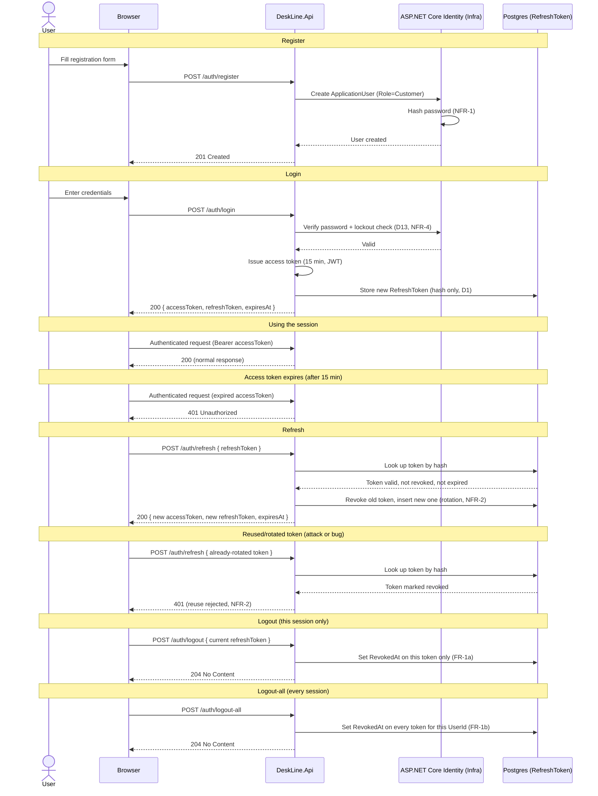
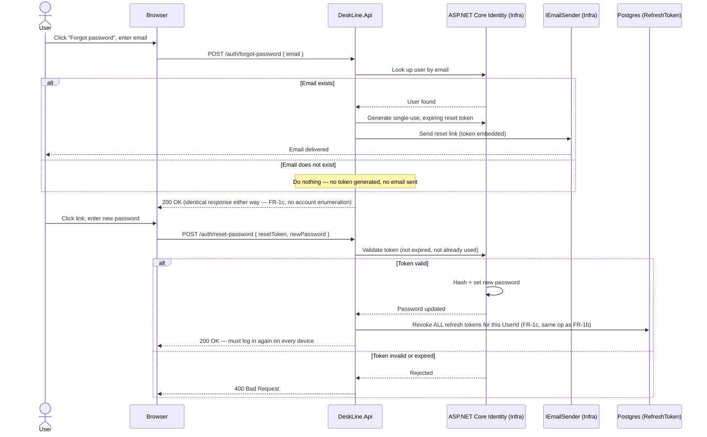

# DeskLine — Auth Sequence Diagrams

**Status:** design artifact (Auth Flow Design)
**Owner:** Omar
**Depends on:** `requirements.md` (FR-1, FR-1a–c), `decisions.md` (D1, D7, D13, D14)

---

## 0. How this doc is organized

Two sequence diagrams, per `project-plan.md` §2.5:

1. **Register → login → refresh → logout** — the full lifecycle of a session
2. **Forgot password → reset** — the recovery flow, kept separate since it issues its own single-use token, distinct from access/refresh tokens

Both render natively on GitHub (Mermaid), no external tool or exported image needed — unlike the ERD, which benefited from dbdiagram.io's schema precision, these are pure control-flow and read fine as text-based diagrams.

`Api` below stands for the whole request pipeline (Controller → Application service), not a single layer — these diagrams are about the auth *flow*, not the Clean Architecture layering already covered in `architecture.md`.

---

## 1. Register → Login → Refresh → Logout

**What this makes concrete, beyond the prose in `decisions.md`:**
- The access token is never looked up in the database — it's just verified as a valid signed JWT (this is *why* a deactivated user's access token stays valid for up to 15 minutes, a limitation already named in README/`project-plan.md` §10).
- The refresh token *is* looked up every time, by its hash — that's what makes revocation and reuse-detection possible at all (D1, D7).
- Rotation means every successful refresh invalidates the token that was just used, replacing it with a new one — so a stolen *old* refresh token is useless the moment the legitimate client refreshes once.

---

## 2. Forgot Password → Reset

**What this makes concrete:**
- The `alt Email exists / else` branch is exactly what "identical response whether or not the email exists" (FR-1c) looks like as control flow — the *branch* happens, but the branch never leaks into what the browser receives.
- Reset success revokes *every* refresh token for the account (reusing FR-1b's exact mechanism), not just issuing a new password — because a password reset is frequently a reaction to a compromised account, so every existing session should die along with the old password (D14).

---

## 3. Traceability note

Both diagrams trace to FR-1/FR-1a/FR-1b/FR-1c and NFR-2/NFR-4, and formalize D1, D7, D13, and D14 as control flow rather than prose. No new decisions are introduced here — this doc is a visualization of choices already logged, not a place new ones get made.
